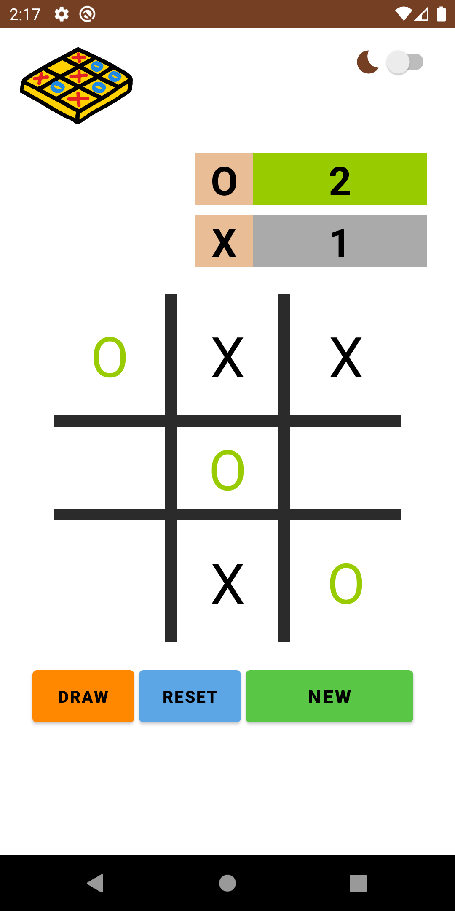
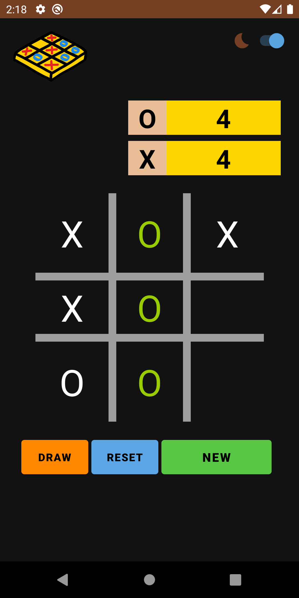

# tic-tac-toe
Tic-tac-toe (American English), noughts and crosses (Commonwealth English and British English), or Xs and Os/“X’y O’sies” (Ireland), is a paper-and-pencil game for two players, X and O, who take turns marking the spaces in a 3×3 grid. 

# Project Images

### TicTacToe Light Theme

### TicTacToe Dark Theme

